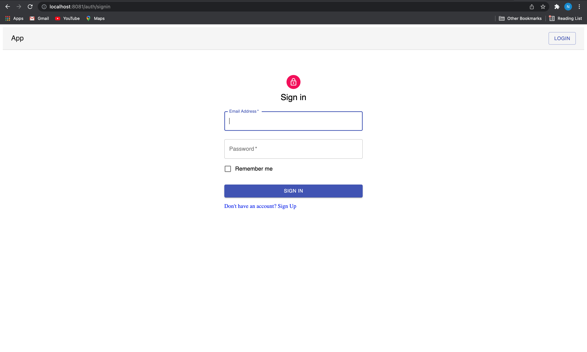
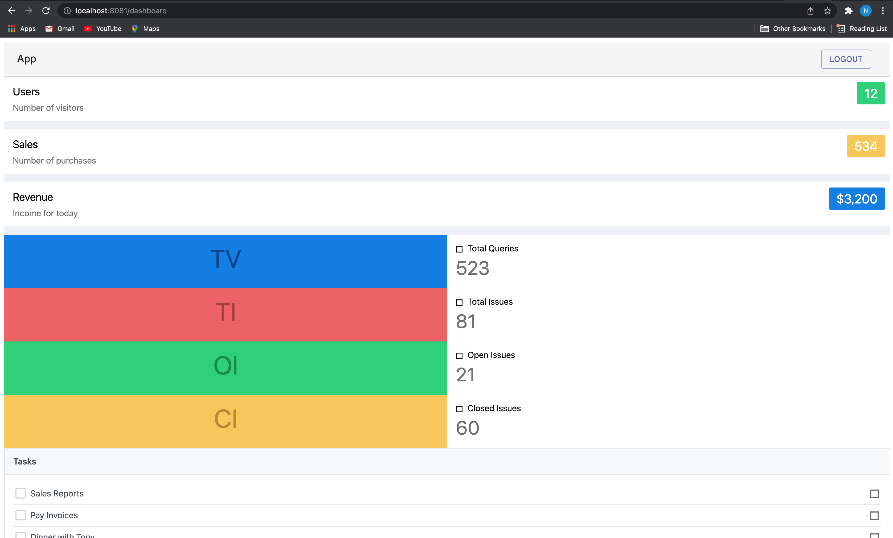

# react-vue-microfrontend

Working implementation of Mirco-frontend Web App using React, Vue and Nx as build framwork using Webpack5 Module Federation

## Microfrontend Architecture

To implement microfrontend architecture we used:

- Webpack 5 [Module Federation](https://www.digitalonus.com/micro-frontends-module-federation-with-webpack-5/)
- Microfrontend apps resides in Nx monorepo
- Container and Auth app built using `React`
- Dashboard app built using `Vue.js`

## Build and Run

Install dependencies

```bash
npm install
```

To run whole app with container and other microfrontends:

```bash
npm run start:all
```

To run one microfrontend separately, for exmample `auth`:

```bash
npx nx run auth:serve
```

List of microfrotend apps, as of now:
| Microfrontend | App Name | Url |
| ------------- | ---------| ----|
| Container | container | http://localhost:8081/|
| Auth | auth | http://localhost:8082/auth/signin|
| Dashboard | dashboard | http://localhost:8083/dashboard|

## Future Task

- Production setup for Mirco-frontend app
- Dockerized application
- CI/CD pipeline

## ScreenShot

### Auth App Built using React



### Dashboard App Built using Vue


